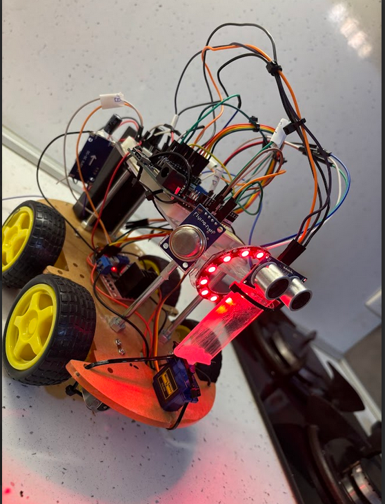

# Autonomous Gas Monitoring Robot

  

Bachelor Thesis Project – Technical University of Sofia

## Overview

## Overview

This project presents the development of an autonomous mobile robot for gas monitoring and obstacle avoidance.

The robot integrates:

- MQ-2 gas sensor for detection of flammable and toxic gases
- HC-SR04 ultrasonic sensor for obstacle avoidance
- ESP8266 (Wemos D1 R2) microcontroller
- L298N motor driver
- SG90 servo motor
- Wi-Fi communication via Blynk IoT platform

## Features

- Real-time gas detection
- Autonomous navigation with obstacle avoidance
- Remote monitoring via Wi-Fi
- Sound and LED alarm system
- Battery-powered mobile platform

## Technologies Used

- Embedded C / Arduino IDE
- IoT communication (Blynk)
- Sensor data processing
- PWM motor control
- Autonomous movement algorithm

## Hardware Components

- ESP8266 (Wemos D1 R2)
- MQ-2 Gas Sensor
- HC-SR04 Ultrasonic Sensor
- L298N Motor Driver
- SG90 Servo Motor
- WS2812B LED Ring

## Documentation

Full thesis documentation available in the /docs folder.

---

Developed by Pavel Avramov
